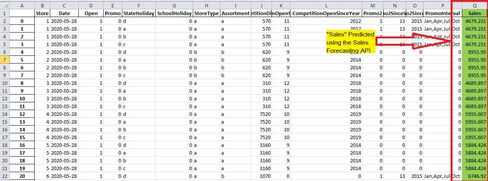

# Sales Forecasting with Watson AutoAI and Python
- This project automates sales forecasting using Watson AutoAI and Python.
- It leverages Watson AutoAI's capabilities to build and deploy a machine learning pipeline for predicting future sales based on historical data.
- The project script utilizes Python libraries to interact with Watson AutoAI and handle data processing tasks.

# Project Structure
This section outlines the key files and resources included in this project:

1. **README.md:** This file provides an overview of the project, including its purpose, usage instructions, and deployment considerations.
2. [**sales-forecasting-with-python-automation-and-ml.ipynb:**](sales-forecasting-with-python-automation-and-ml.ipynb) This Jupyter Notebook file contains the core Python code for interacting with your deployed Watson AutoAI model.
3. **predictedsales.xlsx:** This Excel file is an example output generated by the Python script. It contains the testing data with the predicted sales values added to a dedicated column.
4. [**Training and Testing Dataset (External):**](https://github.com/nicknochnack/ExcelSalesForecast) This project relies on an external Excel dataset for training and testing the sales forecasting model.
   
# Step-by-Step Guide: Building an ML Pipeline for Sales Forecasting with Watson AutoAI (Overview)
This section provides a high-level overview of building a machine learning pipeline with Watson AutoAI in IBM Cloud Pak for Data. 

## Prerequisites
An IBM Cloud account with access to IBM Cloud Pak for Data.

## Steps
1. **Sign up for Watson Studio:** Create an account on IBM Cloud Pak for Data (https://www.ibm.com/products/watson-studio).
2. **Create a Project and Set Up AutoAI:** In Watson Studio, create a new project. Add a new AutoAI experiment to your project. Associate a Watson Machine Learning service with your project (create a new one if needed).
3. **Upload Your Data and Choose the Target:** Upload your sales data set to Watson Studio. Select the target variable in your data set that represents the sales value you want to predict. For this project it's the "Sales" column.
4. **Run the AutoAI Experiment:** Start the AutoAI experiment. Watson AutoAI will automatically explore and analyze your data to find the best machine learning models for sales forecasting.
5. **Evaluate Model Performance:** As the experiment runs, monitor the performance of the models being generated. AutoAI will continue to refine the models until they reach optimal performance.
6. **Deploy Your AutoAI Model:** After the experiment is complete, select the best-performing model for deployment. Deploy the chosen model as a web service in Watson Studio. This allows you to make predictions on new data in real-time.

# Using the Deployed Model with Python Script
This section explains the Python script included in the project, which demonstrates how to interact with your deployed Watson AutoAI model for sales forecasting on new data.

The script performs the following tasks:

1. **Authentication:** Authenticates with IBM Cloud using an API key (replace YOUR_API_KEY in the script with your actual key).
2. **Data Loading:** Loads the testing data for sales forecasting from an Excel file.
3. **Data Preparation:** Prepares the data for prediction by ensuring it aligns with the format expected by the deployed model.
4. **Payload Creation:** Creates a payload in JSON format that encapsulates the prepared testing data for sending to the model.
5. **Prediction Request:** Sends a POST request to the deployed model's endpoint, along with the payload containing the testing data.
6. **Response Processing:** Receives the prediction response from the model and extracts the predicted sales values.
7. **Prediction Integration:** Integrates the predicted sales values into the "Sales" column of the original testing data.
8. **Exporting Results:** Exports the updated testing data with predicted sales values to a new Excel file.
By running this script with your own testing data, you can leverage your deployed model to forecast future sales based on historical trends and patterns identified during training.

# Running the Script from Command Prompt
This section explains how to execute the Python script to interact with your deployed Watson AutoAI model and get sales forecasts on new data using the command prompt:

## Prerequisites:

- **Python:** Ensure you have Python installed on your system and configured correctly in your PATH environment variable.
- **Script:**  Replace sales-forecasting-with-python-automation-and-ml.ipynb with the actual filename of your Python script in the following steps.
- **API Key:** Replace YOUR_API_KEY in the script with your actual IBM Cloud API key.
- **Data File:** Make sure your testing data is available in the specified Excel file path within the script.
## Steps:

1. **Navigate to Script Directory:** Open a command prompt window and use the cd command to navigate to the directory where your Python script is saved.
2. **Run the Script:** Once you're in the correct directory, type the following command and press Enter to execute the script:
<pre>
python sales-forecasting-with-python-automation-and-ml.ipynb
</pre>
3. This will initiate the script's execution. The script will authenticate with IBM Cloud, load your testing data, interact with the deployed model for predictions, and finally export the results with predicted sales values to a new Excel file.

**Additional Notes:**

This approach assumes your deployed model is accessible through an API endpoint. If your deployment involves a different interaction method, the script might need adjustments.

By following these steps, you can leverage your Python script to automate sales forecasting tasks using your deployed Watson AutoAI model from your desktop!.
